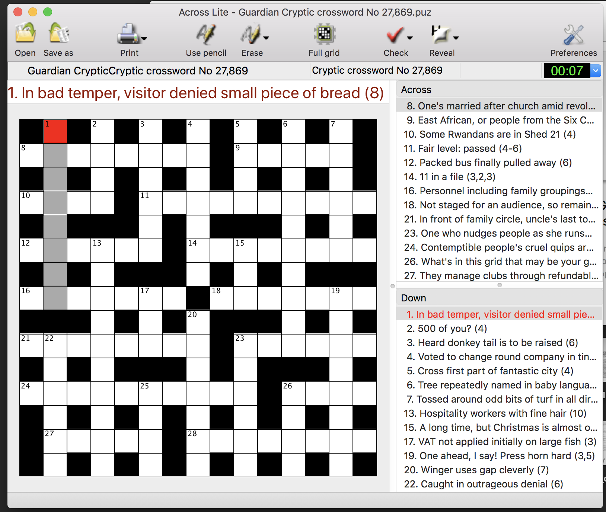

# GuardianPuz

Given a [Guardian](https://www.guardian.co.uk/crosswords) crossword type and number (or just a type), this app downloads a puz file that can be imported into crossword apps like AlphaCross or AcrossLite. 

Most of orginal code is from https://github.com/rentalcustard/guardianpuz. This repo simply updates it for Python 3 + makes a few refactorings. 

## Requirements
* Python 3
* [puzpy](https://github.com/alexdej/puzpy) - `pip install puzpy`
* [beautiful soup](https://www.crummy.com/software/BeautifulSoup/bs4/doc/) - `pip install bs4`
* [requests](https://pypi.org/project/requests/) - `pip install requests`
* [unidecode](https://pypi.org/project/Unidecode/) - `pip install unidecode`
* [numpy](https://www.scipy.org/install.html) - `pip install numpy`

## Installation
1. Make sure the requirements listed above are fulfilled.
2. Clone or download this repo. See the green 'Clone or Download' button above.
3. Run the cloned/downloaded `guardianpuz.py` file as per usage instructions below. 

## Usage

`python guardianpuz.py  --type=TYPE --number=XXXX`

NUMBER is the number of the crossword you want to load, for example 27763. You can find it in the URL, e.g. https://www.theguardian.com/crosswords/cryptic/27763.

TYPE is one of quick, cryptic, weekend, quiptic, speedy, and everyman. Prize, Genius, and Azed are currently not covered. 

This creates a file named `Guardian TYPE Crossword No NUMBER.puz` with your crossword. The file will be saved in the directory from which you execute the script. 

### Examples of usage 

`python guardianpuz.py` # Downloads the latest cryptic puzzle. 

`python guardianpuz.py -t quiptic` # Downloads the latest quiptic puzzle. 

`python guardianpuz.py -t quiptic -n 1025` # Downloads quiptic puzzle number 1025. 

## Compatible Crossword Apps
[cursewords](https://parkerhiggins.net/2019/03/cursewords-crossword-puzzle-solving-interface-terminal/)

[alphacross (Android)](https://play.google.com/store/apps/details?id=org.akop.crosswords&hl=en)

[Across Lite](https://www.litsoft.com/across/alite/download/index.html)

## Example screenshot
**Cursewords Screenshot**

**Across Lite Screenshot**

## Known bugs 
* Encoding related troubles may pop up now and then. 
>
eg: Running python guardianpuz.py -t quick -n 15342 returns the following error:

Traceback (most recent call last):
File "guardianpuz.py", line 102, in 
p.save(save_file_name)
File "/Users/paulpj/.local/lib/python3.7/site-packages/puz.py", line 225, in save
puzzle_bytes = self.tobytes()
File "/Users/paulpj/.local/lib/python3.7/site-packages/puz.py", line 240, in tobytes
self.global_cksum(), ACROSSDOWN.encode(ENCODING),
File "/Users/paulpj/.local/lib/python3.7/site-packages/puz.py", line 366, in global_cksum
cksum = self.text_cksum(cksum)
File "/Users/paulpj/.local/lib/python3.7/site-packages/puz.py", line 354, in text_cksum
cksum = data_cksum(clue.encode(ENCODING), cksum)
UnicodeEncodeError: 'latin-1' codec can't encode character '\u2014' in position 16: ordinal not in range(256)

## ToDos
* Be distributed via pip
* Include error handling and basic checks. 
* Add support for Prize, Genius, and Azed puzzles. 

## Contributing
Make pull requests if you notice anything amiss. 
