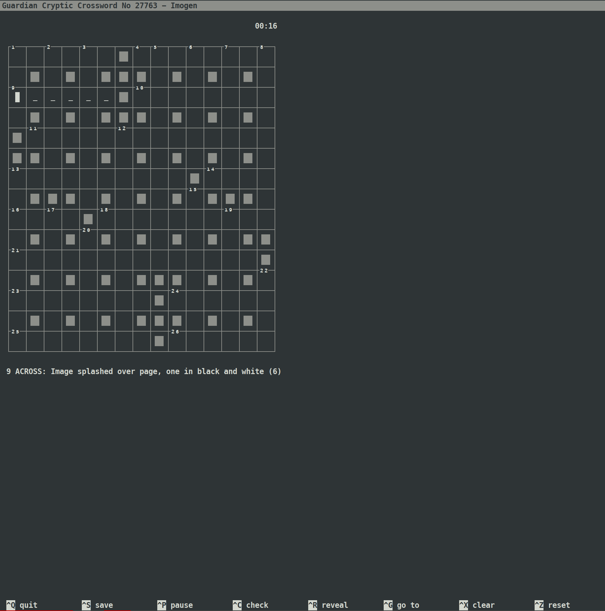

# GuardianPuz

Given a [Guardian](https://www.guardian.co.uk/crosswords) crossword type and number (or just a type), this app downloads a puz file that can be imported into crossword apps like AlphaCross. 

## Requirements
* Python 3
* [puzpy](https://github.com/alexdej/puzpy) - `pip install puzpy`
* [beautiful soup](https://www.crummy.com/software/BeautifulSoup/bs4/doc/) - `pip install bs4`
* numpy - `pip install numpy`

## Installation
1. Make sure the requirements listed above are fulfilled.
2. Clone this repo, or download it as a zip file. 
3. Run the cloned/downloaded `guardianpuz.py` file as per usage instructions below. 

## Usage

`python guardianpuz.py  --type=TYPE --number=XXXX`

NUMBER is the number of the crossword you want to load, for example 27763. You can find it in the URL, e.g. https://www.theguardian.com/crosswords/cryptic/27763.

TYPE is one of quick, cryptic, weekend, quiptic, speedy, and everyman. Prize, Genius, and Azed are currently not covered. 

This creates a file named `Guardian TYPE Crossword No NUMBER.puz` with your crossword. The file will be saved in the directory from which you execute the script. 

### Examples of usage 

`python guardianpuz.py` # Downloads the latest cryptic puzzle. 

`python guardianpuz.py -t quiptic` # Downloads the latest quiptic puzzle. 

`python guardianpuz.py -t quiptic -n 1025` # Downloads quiptic puzzle number 1025. 

## Compatible Crossword Apps
[cursewords](https://parkerhiggins.net/2019/03/cursewords-crossword-puzzle-solving-interface-terminal/)

[alphacross (Android)](https://play.google.com/store/apps/details?id=org.akop.crosswords&hl=en)

[Across Lite](https://www.litsoft.com/across/alite/download/index.html)

## Example screenshot

## Known bugs 
* Encoding related troubles. 

## ToDos
* Be distributed via pip
* Include error handling and basic checks. 
* Add support for Prize, Genius, and Azed puzzles. 

## Contributing
Make pull requests if you notice anything amiss. 
